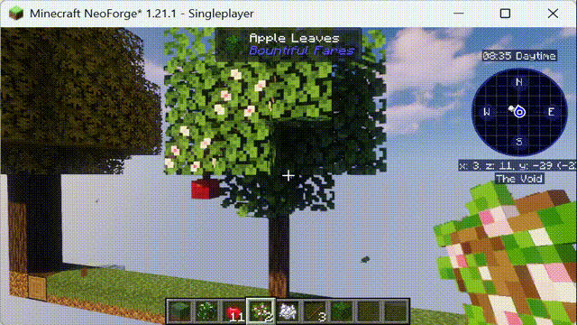

> 需要启用`Common->EnableSeasonDefinition`。




## 基本说明

本配置用于定义在特定群系（不写则为忽略群系判定）中，随季节变化而发生的方块替换、掉落或生成规则。
整合包作者可以通过编写类似的配置文件，为不同方块添加季节变化效果。

该数据包需要配合有随机刻的方块使用，以减少原子操作，如果没有则可以参考数据包基本一节强制方块启用随机刻。

其为json文件，在资源包的放置根目录路径为`data/<命名空间>/eclipticseasons/season_definitions`。

## 文件内容

### 定义示例

这里为模组丰饶食记的苹果树添加了简单的春秋两季节变化。
春季：将自然苹果叶（非玩家放置）16% 概率变为开花叶，且通过固定种子避免过多的变化。在开花叶下方生成悬挂苹果（不重复生成）。
秋季：开花叶重新变回普通苹果叶。悬挂苹果替换为对应掉落物（模拟果实成熟）。

注意此处changes为SolarTermValueMap结构，因此还可以按节气字段进行更精细化调整。

此处还支持自定义条件与放置方法扩展，通过代码可以查看更多。

```json
{
  "biomes": "minecraft:plains",
  "changes": {
    "seasons": {
      "spring": [
        {
          "target": {
            "blocks": "bountifulfares:apple_leaves",
            "state": {
              "persistent": "false"
            }
          },
          "fixed_seed": true,
          "chance": 0.16,
          "place": {
            "block": {
              "Name": "bountifulfares:flowering_apple_leaves"
            },
            "copy_state": true
          }
        },
        {
          "target": {
            "blocks": "bountifulfares:flowering_apple_leaves",
            "state": {
              "persistent": "false"
            }
          },
          "place": {
            "block": {
              "Name": "bountifulfares:hanging_apple"
            },
            "replace": false,
            "offset": [
              0,
              -1,
              0
            ]
          }
        }
      ],
      "autumn": [
        {
          "target": {
            "blocks": "bountifulfares:flowering_apple_leaves",
            "state": {
              "persistent": "false"
            }
          },
          "place": {
            "block": {
              "Name": "bountifulfares:apple_leaves"
            },
            "copy_state": true
          }
        },
        {
          "target": {
            "blocks": "bountifulfares:hanging_apple"
          },
          "place": {
            "loot": "bountifulfares:blocks/hanging_apple"
          }
        }
      ]
    }
  }
}
```
